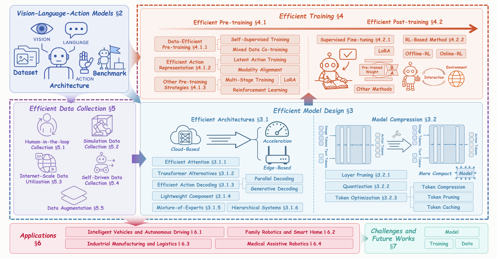
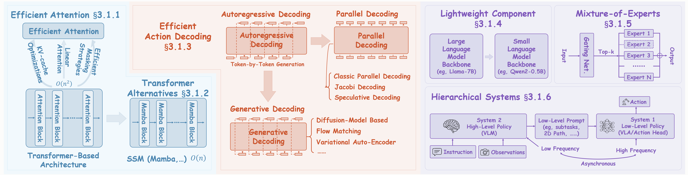

# 🚀Efficient-VLAs-Survey
> This is a curated list of "A Survey on Efficient Vision-Language Action Models" research.

To the best of our knowledge, this work presents the first comprehensive survey specifically dedicated to the realm of **Efficient VLAs** that covers the entire "data-model-training" process. We will continue to UPDATE this repository to provide you with the latest cutting-edge developments, so stay tuned!😘 We hope that our work will bring some inspiration to you.😉

❗Pre-print version to be released soon.

## Overview

**The Organization of Our Survey.** We systematically categorize efficient VLAs into three core pillars: (1) **Efficient Model Design**, encompassing efficient architectures and model compression techniques; (2) **Efficient Training**, covering efficient pre-training and post-training strategies; and (3) **Efficient Data Collection**, including efficient data collection and augmentation methods. The framework also reviews VLA foundations, key applications, challenges, and future directions, establishing the groundwork for advancing scalable embodied intelligence.

## Efficient VLAs

### Efficient Model Design

#### Efficient Architectures

- RoboMamba: Efficient Vision-Language-Action Model for Robotic Reasoning and Manipulation. <ins>arXiv, 2024</ins> [[Paper](https://arxiv.org/abs/2406.04339)]

##### Efficient Attention
- BitVLA: 1-bit Vision-Language-Action Models for Robotics Manipulation. <ins>arXiv, 2025</ins> [[Paper](https://arxiv.org/abs/2506.07530)]

##### Transformer Alternatives
- Fast-in-Slow: A Dual-System Foundation Model Unifying Fast Manipulation within Slow Reasoning. <ins>arXiv, 2025</ins> [[Paper](https://arxiv.org/abs/2506.01953)]

#### Layer Skipping
- EfficientVLA: Training-Free Acceleration and Compression for Vision-Language-Action Models. <ins>arXiv, 2025</ins> [[Paper](https://arxiv.org/abs/2506.10100)]

#### Mixture-of-Experts
- MoLe-VLA: Dynamic Layer-skipping Vision Language Action Model via Mixture-of-Layers for Efficient Robot Manipulation. <ins>arXiv, 2025</ins> [[Paper](https://arxiv.org/abs/2503.20384)]

#### Efficient Use of Tokens

##### Token Compression
- FAST: Efficient Action Tokenization for Vision-Language-Action Models. <ins>arXiv, 2025</ins> [[Paper](https://arxiv.org/abs/2501.09747)]

##### Token Pruning
- SP-VLA: A Joint Model Scheduling and Token Pruning Approach for VLA Model Acceleration. <ins>arXiv, 2025</ins> [[Paper](https://arxiv.org/abs/2506.12723)]

##### Token Caching
- VLA-Cache: Towards Efficient Vision-Language-Action Model via Adaptive Token Caching in Robotic Manipulation. <ins>arXiv, 2025</ins> [[Paper](https://arxiv.org/abs/2502.02175)]
- EfficientVLA: Training-Free Acceleration and Compression for Vision-Language-Action Models. <ins>arXiv, 2025</ins> [[Paper](https://arxiv.org/abs/2506.10100)]
- Fast ECoT: Efficient Embodied Chain-of-Thought via Thoughts Reuse. <ins>arXiv, 2025</ins> [[Paper](https://arxiv.org/abs/2506.07639)]
- Think Twice, Act Once: Token-Aware Compression and Action Reuse for Efficient Inference in Vision-Language-Action Models. <ins>arXiv, 2025</ins> [[Paper](https://arxiv.org/abs/2505.21200)]
- RetoVLA: Reusing Register Tokens for Spatial Reasoning in Vision-Language-Action Models. <ins>arXiv, 2025</ins> [[Paper](https://arxiv.org/abs/2509.21126)]
#### Efficient Action Decoding
##### Generative Modeling-based Method
- VQ-VLA: Improving Vision-Language-Action Models via Scaling Vector-Quantized Action Tokenizers. <ins>arXiv, 2025</ins> [[Paper](https://arxiv.org/abs/2507.01016)]
- Discrete Diffusion VLA: Bringing Discrete Diffusion to Action Decoding in Vision-Language-Action Policies. <ins>arXiv, 2025</ins> [[Paper](https://arxiv.org/pdf/2508.20072)]
- ReconVLA: Reconstructive Vision-Language-Action Model as Effective Robot Perceiver. <ins>arXiv, 2025</ins> [[Paper](https://arxiv.org/abs/2508.10333)]
- SmolVLA: A vision-language-action model for affordable and efficient robotics. <ins>arXiv, 2025</ins> [[Paper](https://arxiv.org/abs/2506.01844)]
- GraphCoT-VLA: A 3D Spatial-Aware Reasoning Vision-Language-Action Model for Robotic Manipulation with Ambiguous Instructions. <ins>arXiv, 2025</ins> [[Paper](https://arxiv.org/abs/2508.07650)]
- MinD: Learning A Dual-System World Model for Real-Time Planning and Implicit Risk Analysis. <ins>arXiv, 2025</ins> [[Paper](https://arxiv.org/abs/2506.18897)]
- FreqPolicy: Efficient Flow-based Visuomotor Policy via Frequency Consistency. <ins>arXiv, 2025</ins> [[Paper](https://arxiv.org/abs/2506.08822)]
##### Parallel Decoding
- Accelerating vision-language-action model integrated with action chunking via parallel decoding. <ins>arXiv, 2025</ins> [[Paper](https://arxiv.org/abs/2503.02310)]
- CEED-VLA: Consistency Vision-Language-Action Model with Early-Exit Decoding. <ins>arXiv, 2025</ins> [[Paper](https://arxiv.org/abs/2506.13725)]
- Spec-VLA: Speculative Decoding for Vision-Language-Action Models with Relaxed Acceptance. <ins>arXiv, 2025</ins> [[Paper](https://arxiv.org/abs/2507.22424)]
- CogVLA: Cognition-Aligned Vision-Language-Action Model via Instruction-Driven Routing & Sparsification. <ins>arXiv, 2025</ins> [[Paper](https://arxiv.org/abs/2508.21046)]
- EdgeVLA: Efficient Vision-Language-Action Models. <ins>arXiv, 2025</ins> [[Paper](https://arxiv.org/abs/2507.14049)]
- Fast ECoT: Efficient Embodied Chain-of-Thought via Thoughts Reuse. <ins>arXiv, 2025</ins> [[Paper](https://arxiv.org/abs/2506.07639)]
- Fine-Tuning Vision-Language-Action Models: Optimizing Speed and Success. <ins>arXiv, 2025</ins> [[Paper](https://arxiv.org/abs/2502.19645)]
  
#### Training-Free Inference Efficiency

#### Asynchronous Inference
- Fast ECoT: Efficient Embodied Chain-of-Thought via Thoughts Reuse. <ins>arXiv, 2025</ins> [[Paper](https://arxiv.org/abs/2506.07639)]
- SmolVLA: A vision-language-action model for affordable and efficient robotics. <ins>arXiv, 2025</ins> [[Paper](https://arxiv.org/abs/2506.01844)]
- Real-Time Execution of Action Chunking Flow Policies. <ins>arXiv, 2025</ins> [[Paper](https://arxiv.org/abs/2506.07339)]
- Leave No Observation Behind: Real-time Correction for VLA Action Chunks. <ins>arXiv, 2025</ins> [[Paper](https://arxiv.org/abs/2509.23224)]

### Hardware-Aware Efficiency
- Leveraging OS-Level Primitives for Robotic Action Management. <ins>arXiv, 2025</ins> [[Paper](https://arxiv.org/abs/2508.10259)]

### Training Efficiency

#### Efficient Pre-Training
- SimpleVLA-RL: Scaling VLA Training via Reinforcement Learning. <ins>arXiv, 2025</ins> [[Paper](https://arxiv.org/abs/2509.09674)]
- Long-VLA: Unleashing Long-Horizon Capability of Vision Language Action Model for Robot Manipulation. <ins>arXiv, 2025</ins> [[Paper](https://arxiv.org/abs/2508.19958)]
- FlowVLA: Thinking in Motion with a Visual Chain of Thought. <ins>arXiv, 2025</ins> [[Paper](https://arxiv.org/abs/2508.18269)]
- VOTE: Vision-Language-Action Optimization with Trajectory Ensemble Voting. <ins>arXiv, 2025</ins> [[Paper](https://arxiv.org/abs/2507.05116)]
- cVLA: Towards Efficient Camera-Space VLAs. <ins>arXiv, 2025</ins> [[Paper](https://arxiv.org/abs/2507.02190)]
- Conditioning Matters: Training Diffusion Policies is Faster Than You Think. <ins>arXiv, 2025</ins> [[Paper](https://arxiv.org/abs/2505.11123)]
- Training Strategies for Efficient Embodied Reasoning. <ins>arXiv, 2025</ins> [[Paper](https://arxiv.org/abs/2505.08243)]
- Latent Action Pretraining Through World Modeling. <ins>arXiv, 2025</ins> [[Paper](https://arxiv.org/abs/2509.18428)]
- Diffusion Trajectory-guided Policy for Long-horizon Robot Manipulation. <ins>arXiv, 2025</ins> [[Paper](https://arxiv.org/abs/2502.10040)]
- DexVLA: Vision-Language Model with Plug-In Diffusion Expert for General Robot Control. <ins>CoRL, 2025</ins> [[Paper](https://arxiv.org/abs/2502.05855)]
- Diffusion-VLA: Generalizable and Interpretable Robot Foundation Model via Self-Generated Reasoning. <ins>ICML, 2025</ins> [[Paper](https://arxiv.org/abs/2412.03293)]
- Latent Action Pretraining from Videos. <ins>ICLR, 2025</ins> [[Paper](https://arxiv.org/abs/2410.11758)]
- LLaRA: Supercharging Robot Learning Data for Vision-Language Policy. <ins>ICLR, 2025</ins> [[Paper](https://arxiv.org/abs/2406.20095)]
- Learning Efficient and Robust Language-conditioned Manipulation using Textual-Visual Relevancy and Equivariant Language Mapping. <ins>RA-L, 2025</ins> [[Paper](https://arxiv.org/abs/2406.15677)]
- Focusing on What Matters: Object-Agent-centric Tokenization for Vision Language Action Models. <ins>RA-L, 2025</ins> [[Paper](https://arxiv.org/abs/2509.23655)]
#### Efficient Post-Training
- TinyVLA: Towards Fast, Data-Efficient Vision-Language-Action Models for Robotic Manipulation. <ins>RA-L, 2025</ins> [[Paper](https://arxiv.org/abs/2409.12514)]
- RoboMamba: Efficient Vision-Language-Action Model for Robotic Reasoning and Manipulation.<ins>arXiv, 2024</ins> [[Paper](https://arxiv.org/abs/2406.04339)]
- VQ-VLA: Improving Vision-Language-Action Models via Scaling Vector-Quantized Action Tokenizers. <ins>arXiv, 2025</ins> [[Paper](https://arxiv.org/abs/2507.01016)]
- VLA-Adapter: An Effective Paradigm for Tiny-Scale Vision-Language-Action Model. <ins>arXiv, 2025</ins> [[Paper](https://arxiv.org/abs/2509.09372)]
- FLOWER: Democratizing Generalist Robot Policies with Efficient Vision-Language-Action Flow Policies. <ins>arXiv, 2025</ins> [[Paper](https://arxiv.org/abs/2509.04996)]
- Balancing Signal and Variance: Adaptive Offline RL Post-Training for VLA Flow Models. <ins>arXiv, 2025</ins> [[Paper](https://arxiv.org/abs/2509.04063)]
- Align-Then-stEer: Adapting the Vision-Language Action Models through Unified Latent Guidance. <ins>arXiv, 2025</ins> [[Paper](https://arxiv.org/abs/2509.02055)]
- CO-RFT: Efficient Fine-Tuning of Vision-Language-Action Models through Chunked Offline Reinforcement Learning. <ins>arXiv, 2025</ins> [[Paper](https://arxiv.org/abs/2508.02219)]
- RICL: Adding In-Context Adaptability to Pre-Trained Vision-Language-Action Models. <ins>arXiv, 2025</ins> [[Paper](https://arxiv.org/abs/2508.02062)]
- Vision-Language-Action Instruction Tuning: From Understanding to Manipulation. <ins>arXiv, 2025</ins> [[Paper](https://arxiv.org/abs/2507.17520)]
- Dual-Actor Fine-Tuning of VLA Models: A Talk-and-Tweak Human-in-the-Loop Approach. <ins>arXiv, 2025</ins> [[Paper](https://arxiv.org/abs/2509.13774)]
- GR-3 Technical Report. <ins>arXiv, 2025</ins> [[Paper](https://arxiv.org/abs/2507.15493)]
- Unified Vision-Language-Action Model. <ins>arXiv, 2025</ins> [[Paper](https://arxiv.org/abs/2506.19850)]
- ControlVLA: Few-shot Object-centric Adaptation for Pre-trained Vision-Language-Action Models. <ins>arXiv, 2025</ins> [[Paper](https://arxiv.org/abs/2506.16211)]
- Knowledge Insulating Vision-Language-Action Models: Train Fast, Run Fast, Generalize Better. <ins>arXiv, 2025</ins> [[Paper](https://arxiv.org/abs/2505.23705)]
- VLA-RL: Towards Masterful and General Robotic Manipulation with Scalable Reinforcement Learning. <ins>arXiv, 2025</ins> [[Paper](https://arxiv.org/abs/2505.18719)]
- Interactive Post-Training for Vision-Language-Action Models. <ins>arXiv, 2025</ins> [[Paper](https://arxiv.org/abs/2505.17016)]
- Prepare Before You Act: Learning From Humans to Rearrange Initial States. <ins>arXiv, 2025</ins> [[Paper](https://arxiv.org/abs/2509.18043)]
- Saliency-Aware Quantized Imitation Learning for Efficient Robotic Control. <ins>arXiv, 2025</ins> [[Paper](https://arxiv.org/abs/2505.15304)]
- Object-Focus Actor for Data-efficient Robot Generalization Dexterous Manipulation. <ins>arXiv, 2025</ins> [[Paper](https://arxiv.org/abs/2505.15098)]
- MoManipVLA: Transferring Vision-language-action Models for General Mobile Manipulation. <ins>arXiv, 2025</ins> [[Paper](https://arxiv.org/abs/2503.13446)]
- Refined Policy Distillation: From VLA Generalists to RL Experts. <ins>arXiv, 2025</ins> [[Paper](https://arxiv.org/abs/2503.05833)]
- HAMSTER: Hierarchical Action Models For Open-World Robot Manipulation. <ins>arXiv, 2025</ins> [[Paper](https://arxiv.org/abs/2502.05485)]
- ConRFT: A Reinforced Fine-tuning Method for VLA Models via Consistency Policy. <ins>arXiv, 2025</ins> [[Paper](https://arxiv.org/abs/2502.05450)]
- Diffusion-VLA: Generalizable and Interpretable Robot Foundation Model via Self-Generated Reasoning. <ins>ICML, 2025</ins> [[Paper](https://arxiv.org/abs/2412.03293)]
- Teaching RL Agents to Act Better: VLM as Action Advisor for Online Reinforcement Learning. <ins>arXiv, 2025</ins> [[Paper](https://arxiv.org/abs/2509.21243)]
- OpenVLA: An Open-Source Vision-Language-Action Model. <ins>arXiv, 2024</ins> [[Paper](https://arxiv.org/abs/2406.09246)]
- A Self-Correcting Vision-Language-Action Model for Fast and Slow System Manipulation. <ins>arXiv, 2024</ins> [[Paper](https://arxiv.org/abs/2405.17418)]
- World-Env: Leveraging World Model as a Virtual Environment for VLA Post-Training. <ins>arXiv, 2024</ins> [[Paper](https://arxiv.org/abs/2509.24948)]
- VLA-RFT: Vision-Language-Action Reinforcement Fine-tuning with Verified Rewards in World Simulators. <ins>arXiv, 2024</ins> [[Paper](https://arxiv.org/abs/2510.00406)]

### Efficient Data Collection

#### Sim/Real
- ERMV: Editing 4D Robotic Multi-view images to enhance embodied agents. <ins>arXiv, 2025</ins> [[Paper](https://arxiv.org/abs/2507.17462)]
- XRoboToolkit: A Cross-Platform Framework for Robot Teleoperation. <ins>arXiv, 2025</ins> [[Paper](https://arxiv.org/abs/2508.00097)]
- SmolVLA: A vision-language-action model for affordable and efficient robotics. <ins>arXiv, 2025</ins> [[Paper](https://arxiv.org/abs/2506.01844)]
- Being-H0: Vision-Language-Action Pretraining from Large-Scale Human Videos. <ins>arXiv, 2025</ins> [[Paper](https://arxiv.org/abs/2507.15597)]
- GR-3 Technical Report. <ins>arXiv, 2025</ins> [[Paper](https://arxiv.org/abs/2507.15493)]
- AnyPos: Automated Task-Agnostic Actions for Bimanual Manipulation. <ins>arXiv, 2025</ins> [[Paper](https://arxiv.org/abs/2507.12768)]
- EgoVLA: Learning Vision-Language-Action Models from Egocentric Human Videos. <ins>arXiv, 2025</ins> [[Paper](https://arxiv.org/abs/2507.12440)]
- RynnVLA-001: Using Human Demonstrations to Improve Robot Manipulation. <ins>arXiv, 2025</ins> [[Paper](https://arxiv.org/abs/2509.15212)]
- RealMirror: A Comprehensive, Open-Source Vision-Language-Action Platform for Embodied AI. <ins>arXiv, 2025</ins> [[Paper](https://arxiv.org/abs/2509.14687)]
- RoboTwin 2.0: A Scalable Data Generator and Benchmark with Strong Domain Randomization for Robust Bimanual Robotic Manipulation. <ins>arXiv, 2025</ins> [[Paper](https://arxiv.org/abs/2506.18088)]
- Genie Centurion: Accelerating Scalable Real-World Robot Training with Human Rewind-and-Refine Guidance. <ins>arXiv, 2025</ins> [[Paper](https://arxiv.org/abs/2505.18793)]
- Real2Render2Real: Scaling Robot Data Without Dynamics Simulation or Robot Hardware. <ins>CoRL, 2025</ins> [[Paper](https://arxiv.org/abs/2505.09601)]
- GraspVLA: a Grasping Foundation Model Pre-trained on Billion-scale Synthetic Action Data. <ins>arXiv, 2025</ins> [[Paper](https://arxiv.org/abs/2505.03233)]
- Boosting Robotic Manipulation Generalization with Minimal Costly Data. <ins>arXiv, 2025</ins> [[Paper](https://arxiv.org/abs/2503.19516)]
- ReBot: Scaling Robot Learning with Real-to-Sim-to-Real Robotic Video Synthesis. <ins>IROS, 2025</ins> [[Paper](https://arxiv.org/abs/2503.14526)]
- An Atomic Skill Library Construction Method for Data-Efficient Embodied Manipulation. <ins>arXiv, 2025</ins> [[Paper](https://arxiv.org/abs/2501.15068)]
- OmniManip: Towards General Robotic Manipulation via Object-Centric Interaction Primitives as Spatial Constraints. <ins>arXiv, 2025</ins> [[Paper](https://arxiv.org/abs/2501.03841)]
- Beyond Human Demonstrations: Diffusion-Based Reinforcement Learning to Generate Data for VLA Training. <ins>arXiv, 2025</ins> [[Paper](https://arxiv.org/abs/2509.19752)]
- Developing Vision-Language-Action Model from Egocentric Videos. <ins>arXiv, 2025</ins> [[Paper](https://arxiv.org/abs/2509.21986)]
- MimicDreamer: Aligning Human and Robot Demonstrations for Scalable VLA Training. <ins>arXiv, 2025</ins> [[Paper](https://arxiv.org/abs/2509.22199)]
- EMMA: Generalizing Real-World Robot Manipulation via Generative Visual Transfer. <ins>arXiv, 2025</ins> [[Paper](https://arxiv.org/abs/2509.22407)]

#### Pre-Training Data

#### Finetuning Data

### Evaluation
#### Efficient Evaluation
- Static and Plugged: Make Embodied Evaluation Simple. <ins>arXiv, 2025</ins> [[Paper](https://arxiv.org/abs/2508.06553)]
- Evaluating Uncertainty and Quality of Visual Language Action-enabled Robots. <ins>arXiv, 2025</ins> [[Paper](https://arxiv.org/abs/2507.17049)]

### Applications
- RoboChemist: Long-Horizon and Safety-Compliant Robotic Chemical Experimentation. <ins>arXiv, 2025</ins> [[Paper](https://arxiv.org/abs/2509.08820)]
- FastDriveVLA: Efficient End-to-End Driving via Plug-and-Play Reconstruction-based Token Pruning. <ins>arXiv, 2025</ins> [[Paper](https://arxiv.org/abs/2507.23318)]
- GRaD-Nav++: Vision-Language Model Enabled Visual Drone Navigation with Gaussian Radiance Fields and Differentiable Dynamics. <ins>arXiv, 2025</ins> [[Paper](https://arxiv.org/abs/2506.14009)]
- Hybrid Reasoning for Perception, Explanation, and Autonomous Action in Manufacturing. <ins>arXiv, 2025</ins> [[Paper](https://arxiv.org/abs/2506.08462)]
- CombatVLA: An Efficient Vision-Language-Action Model for Combat Tasks in 3D Action Role-Playing Games. <ins>ICCV, 2025</ins> [[Paper](https://arxiv.org/abs/2503.09527)]
- Humanoid-VLA: Towards Universal Humanoid Control with Visual Integration. <ins>arXiv, 2025</ins> [[Paper](https://arxiv.org/abs/2502.14795)]
