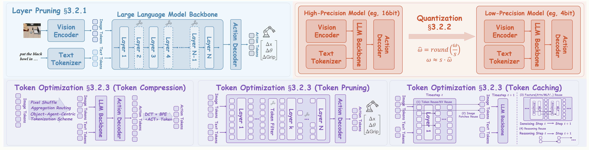
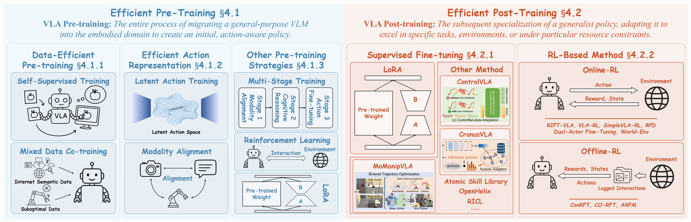
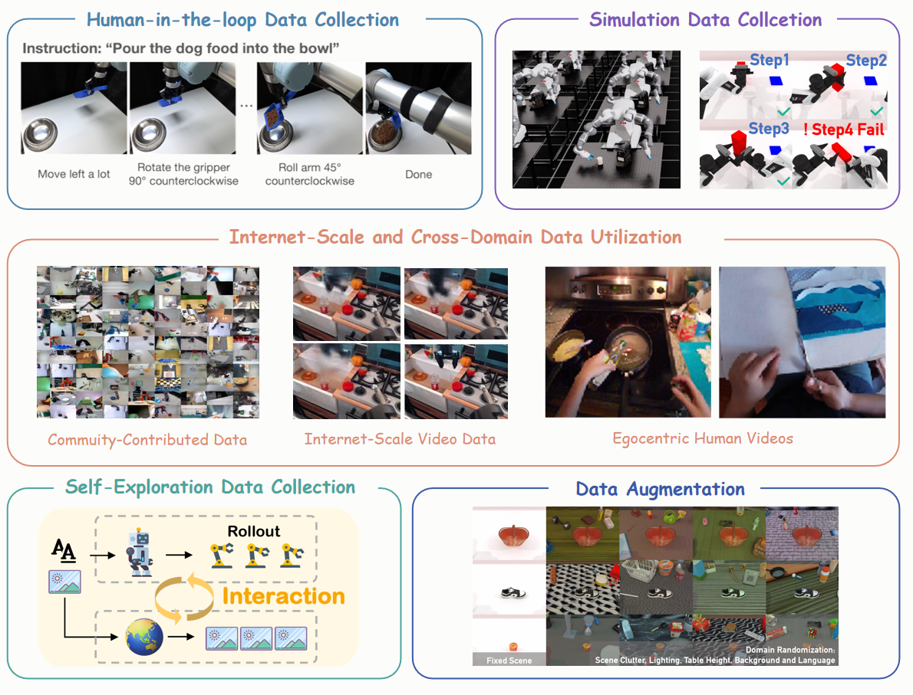

# 🚀Efficient-VLAs-Survey
> This is a curated list of "A Survey on Efficient Vision-Language Action Models" research.

To the best of our knowledge, this work presents the first comprehensive survey specifically dedicated to the realm of **Efficient VLAs** that covers the entire "data-model-training" process. We will continue to UPDATE this repository to provide you with the latest cutting-edge developments, so stay tuned!😘 We hope that our work will bring some inspiration to you.😉

❗Pre-print version to be released soon.

## Overview

Fig. 1: **The Organization of Our Survey.** We systematically categorize efficient VLAs into three core pillars: (1) **Efficient Model Design**, encompassing efficient architectures and model compression techniques; (2) **Efficient Training**, covering efficient pre-training and post-training strategies; and (3) **Efficient Data Collection**, including efficient data collection and augmentation methods. The framework also reviews VLA foundations, key applications, challenges, and future directions, establishing the groundwork for advancing scalable embodied intelligence.

## Efficient VLAs

### Efficient Model Design

#### Efficient Architectures

Fig. 2: Key strategies for **Efficient Architectures** in VLAs. We illustrate six primary approaches: (a) **Efficient Attention**, mitigating the O(n^2) complexity of standard self-attention; (b) **Transformer Alternatives**, such as Mamba; (c) **Efficient Action Decoding**, advancing from autoregressive generation to parallel and generative methods; (d) **Lightweight Components**, adopting smaller model backbones; (e) **Mixture-of-Experts**, employing sparse activation via input routing; and (f) **Hierarchical Systems**, which decouple high-level VLM planning from low-level VLA execution.

##### Efficient Attention
| Year | Venue | Paper | Website | Code |
|------|-------|-------|---------|------|
| 2024 | ICRA | [SARA-RT: Scaling up Robotics Transformers with Self-Adaptive Robust Attention](https://arxiv.org/abs/2312.01990) | - | - |
| 2025 | arXiv | [Long-VLA: Unleashing Long-Horizon Capability of Vision Language Action Model for Robot Manipulation](https://arxiv.org/abs/2508.19958) | [🌐](https://long-vla.github.io/) | - |
| 2025 | arXiv | [RetoVLA: Reusing Register Tokens for Spatial Reasoning in Vision-Language-Action Models](https://arxiv.org/abs/2509.21243) | [🌐](https://www.youtube.com/watch?v=2CseBR-snZg&feature=youtu.be) | - |
| 2025 | arXiv | [KV-Efficient VLA: A Method of Speed up Vision Language Model with RNN-Gated Chunked KV Cache](https://arxiv.org/abs/2509.21354) | - | - |
| 2025 | arXiv | [dVLA: Diffusion Vision-Language-Action Model with Multimodal Chain-of-Thought](https://arxiv.org/abs/2509.25681) | - | - |
##### Transformer Alternatives
| Year | Venue | Paper | Website | Code |
|------|-------|-------|---------|------|
| 2024 | NeurIPS | [RoboMamba: Efficient Vision-Language-Action Model for Robotic Reasoning and Manipulation](https://arxiv.org/abs/2406.04339) | [🌐](https://sites.google.com/view/robomamba-web) | [💻](https://github.com/lmzpai/roboMamba) |
| 2025 | arXiv | [FlowRAM: Grounding Flow Matching Policy with Region-Aware Mamba Framework for Robotic Manipulation](https://arxiv.org/abs/2506.16201) | - | - |

##### Efficient Action Decoding
| Year | Venue | Paper | Website | Code |
|------|-------|-------|---------|------|
| 2024 | NeurIPS | [RoboMamba: Efficient Vision-Language-Action Model for Robotic Reasoning and Manipulation](https://arxiv.org/abs/2406.04339) | [🌐](https://sites.google.com/view/robomamba-web) | [💻](https://github.com/lmzpai/roboMamba) |
| 2025 | arXiv | [FlowRAM: Grounding Flow Matching Policy with Region-Aware Mamba Framework for Robotic Manipulation](https://arxiv.org/abs/2506.16201) | - | - |

##### Lightweight Component
- MoLe-VLA: Dynamic Layer-skipping Vision Language Action Model via Mixture-of-Layers for Efficient Robot Manipulation. <ins>arXiv, 2025</ins> [[Paper](https://arxiv.org/abs/2503.20384)]

##### Mixture-of-Experts
- MoLe-VLA: Dynamic Layer-skipping Vision Language Action Model via Mixture-of-Layers for Efficient Robot Manipulation. <ins>arXiv, 2025</ins> [[Paper](https://arxiv.org/abs/2503.20384)]

##### Hierarchical Systems
- MoLe-VLA: Dynamic Layer-skipping Vision Language Action Model via Mixture-of-Layers for Efficient Robot Manipulation. <ins>arXiv, 2025</ins> [[Paper](https://arxiv.org/abs/2503.20384)]

#### Model Compression

Fig. 3: Key strategies for **Model Compression** in VLAs. We illustrate three primary approaches: (a) **Layer Pruning**, which removes redundant layers to reduce model depth and computational cost; (b) **Quantization**, which reduces the numerical precision of model parameters to decrease memory footprint and accelerate inference; and (c) **Token Optimization**, which minimizes the number of processed tokens via token compression (merging tokens), token pruning (dropping non-essential tokens), and token caching (reusing static tokens).

##### Layer Pruning
- FAST: Efficient Action Tokenization for Vision-Language-Action Models. <ins>arXiv, 2025</ins> [[Paper](https://arxiv.org/abs/2501.09747)]

##### Quantization
- SP-VLA: A Joint Model Scheduling and Token Pruning Approach for VLA Model Acceleration. <ins>arXiv, 2025</ins> [[Paper](https://arxiv.org/abs/2506.12723)]

##### Token Optimization
- VLA-Cache: Towards Efficient Vision-Language-Action Model via Adaptive Token Caching in Robotic Manipulation. <ins>arXiv, 2025</ins> [[Paper](https://arxiv.org/abs/2502.02175)]

### Efficient Training

Fig. 4: Key strategies for **Efficient Training** in VLAs, divided into two main stages. (a) **Efficient Pre-Training** migrates general-purpose VLMs into the embodied domain to create an initial, action-aware policy, encompassing **Data-Efficient Pre-training**, **Efficient Action Representation**, and **Other Pre-training Strategies**. (b) **Efficient Post-Training** subsequently specializes this policy for specific tasks, leveraging **Supervised Fine-tuning** and **RL-Based Methods**.

#### Efficient Pre-Training

##### Data-Efficient Pre-training

##### Efficient Action Representation

##### Other Pre-training Strategies

#### Efficient Post-Training

##### Supervised Fine-tuning

##### RL-Based Method

#### Efficient Data Collection

Fig. 5: Taxonomy of **Efficient Data Collection** strategies in VLAs. This figure illustrates the primary approaches, encompassing human-in-the-loop, simulated, reusability-oriented, self-driven, and augmentative techniques for scalable acquisition of high-quality robotic datasets while minimizing resource overhead.

##### Human-in-the-Loop Data Collection
| Year | Venue | Paper       | Website | Code |
| ---- | ----- | ----------- | ------- | ---- |
| Year | Venue | Paper                                                                                                                                              | Website                                  | Code                                      |
| ---- | ----- | -------------------------------------------------------------------------------------------------------------------------------------------------- | ---------------------------------------- | ----------------------------------------- |
| 2024 | RSS   | [CLIP-RT: Learning Language-Conditioned Robotic Policies from Natural Language Supervision](https://arxiv.org/abs/2411.00508)                      | [🌐](https://clip-rt.github.io/)         | [💻](https://github.com/clip-rt/clip-rt)  |
| 2025 | arXiv | [GCENT: Genie Centurion — Accelerating Scalable Real-World Robot Training with Human Rewind-and-Refine Guidance](https://arxiv.org/abs/2505.18793) | [🌐](https://genie-centurion.github.io/) | [💻](https://huggingface.co/agibot-world) |

##### Simulation Data Collection

##### Internet-Scale and Cross-Domain Data Utilization

##### Self-Exploration Data Collection

##### Data Augmentation

## Contact Us

For any questions or suggestions, please feel free to contact us at:

Email: yuzhaoshu@gmail.com
